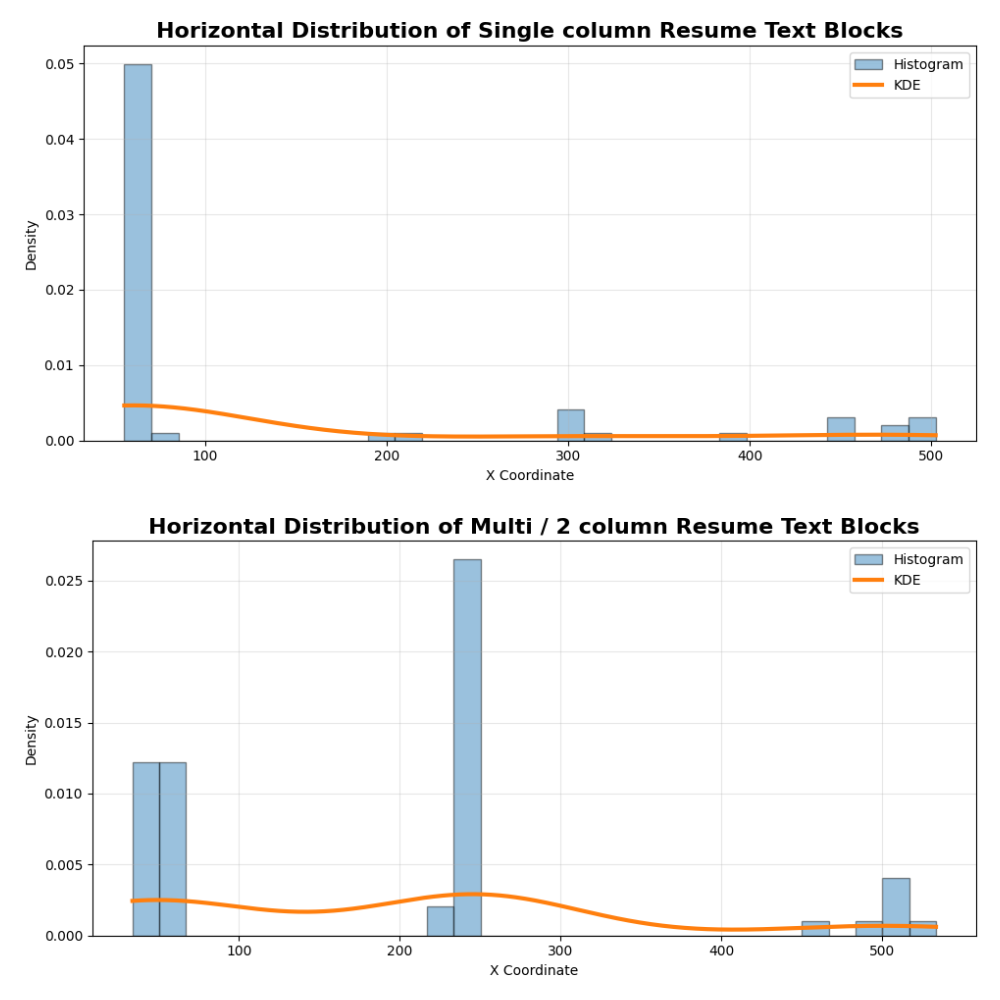
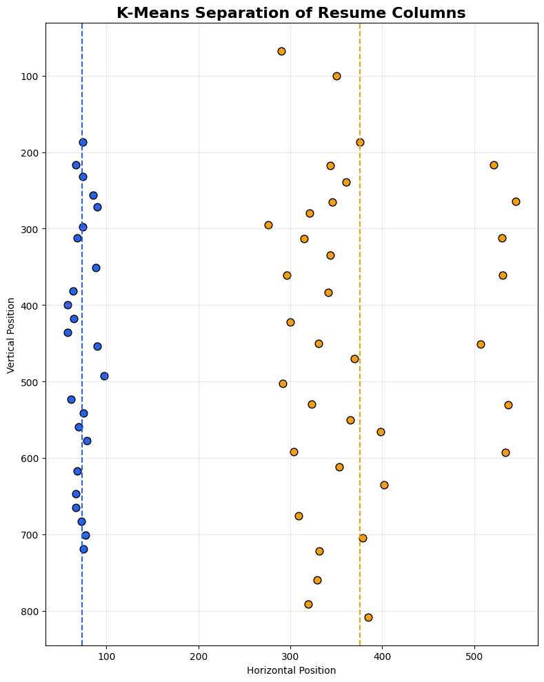
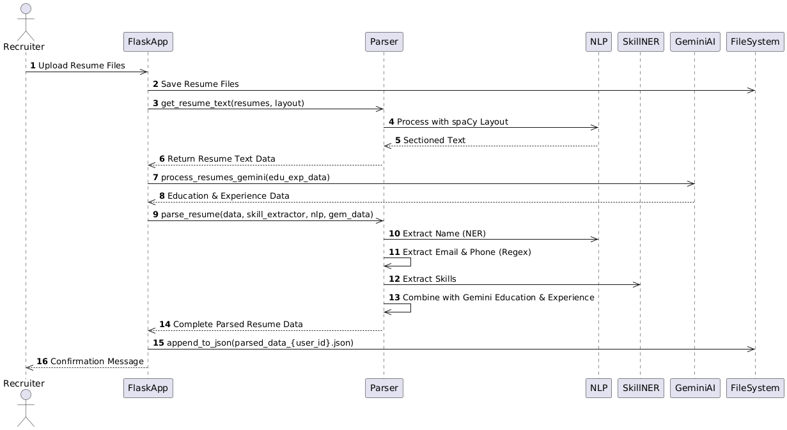
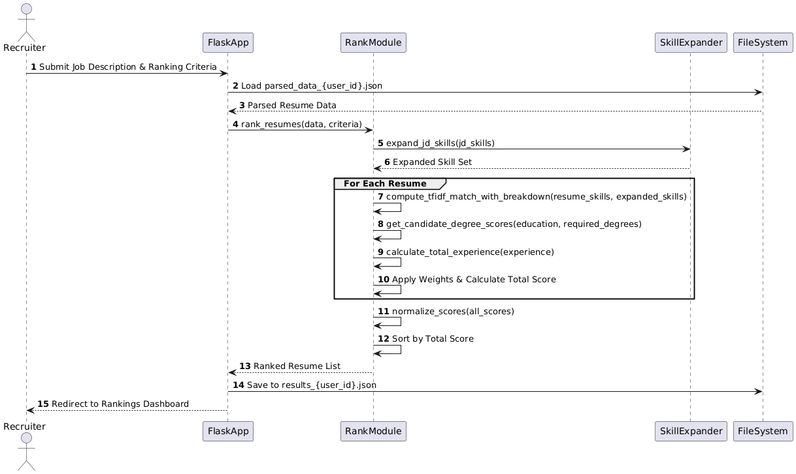

# 🤖 AI-Powered Resume Parsing & Screening System

An intelligent recruitment platform that automatically parses resumes,
extracts structured candidate information, and ranks applicants against
a job description using a hybrid NLP + LLM pipeline.

## ✨ Highlights

- 📄 Robust multi-column detection using Machine learning
- 🤖 Hybrid NLP +  LLM extraction
- 🧠 Semantic skill matching with LLM-expanded job skills
- 📊 Explainable candidate ranking
- ⚡ Supports batch resume screening
- 🔐 Per-user LLM API key management.

---

## 🧩 System Overview

```
 Raw Resume (PDF/Image)
        ↓
 Layout Detection & Column Analysis
        ↓
 Hybrid Information Extraction
 (spaCy · Regex · SkillNER · LLM)
        ↓
 Structured JSON Resume Data
        ↓
 Multi-Criteria Screening & Ranking
        ↓
 Ranked Candidate Shortlist
```

---

## 📄 Part 1 — Resume Parsing (Hybrid Approach)

### 🏗️ Multi-Column Layout Detection

One of the core challenges in resume parsing is handling **multi-column layouts**, which break naive top-to-bottom text extraction. This system detects them before any extraction begins.

**How it works:**

1. All text blocks are extracted with their `x`, `y`, and `width` coordinates using spaCy layout objects
2. A **horizontal density profile** is built by projecting all blocks onto the X-axis across a 1000-unit resolution grid
3. A **Gaussian filter** smooths the profile to reduce noise
4. The smoothed profile is analyzed using **peak detection on its inverse** — dips in coverage between columns appear as valleys

```python
valleys, _ = find_peaks(
    -profile,
    prominence=profile.max() * 0.2
)
# Valley detected → multi-column layout confirmed
```

<p align="center">

</p>

> 📊 Single-column resumes produce a flat, uniform X-profile.  
> Multi-column resumes show a clear **valley** between the two content regions, The valley between peaks indicates the separation between two columns.

<p align="center">

</p>
**After detection:**

- If multi-column is confirmed, **K-Means clustering (k=2)** is applied to the X-coordinates of all blocks
- This cleanly separates content into left and right columns
- Each cluster is then normalized and read in the correct logical order before any further extraction

<p align="center">

</p>

---

### 👤 Named Entity Extraction

- The **first few layout objects** (top of the resume) are passed to a **spaCy Transformer (trf) model**
- The model identifies the candidate's **name** from the header region with high accuracy, avoiding false positives from company names or references elsewhere in the document

---

### 📬 Contact Information

- **Email** and **phone number** are extracted using targeted **Regex patterns**
- Handles international formats, extensions, and common variations

---

### 🛠️ Skills Extraction

- Skills are distributed throughout the entire resume — not confined to a single section
- **[SkillNER](https://github.com/AnasAito/SkillNER)** is used for extraction, which leverages a large cross-domain skill ontology (EMSI/Lightcast)
- This captures technical skills, soft skills, tools, frameworks, and domain knowledge uniformly across the full resume text

---

### 📑 Section-Based Structured Extraction (LLM)

Complex sections like **Experience**, **Education**, and **Projects** require contextual understanding that rule-based methods struggle with.

**Approach:**

1. A **sectioning algorithm** identifies and isolates each logical section of the resume
2. Only the **relevant section text** is passed to the LLM — not the entire document — keeping prompts lean and accurate
3. This is orchestrated via **LangChain with the Google Gemini API**
4. The LLM returns clean, **structured JSON** for each section

This hybrid approach — rules for what's simple, LLM for what's complex — maximizes accuracy while minimizing token usage.

**Final output per resume:**
```json
{
  "name": "Jane Doe",
  "email": "jane@example.com",
  "phone": "+1-555-0100",
  "skills": ["Python", "Machine Learning", "SQL"],
  "experience": [{ "title": "...", "company": "...", "duration": "..." }],
  "education": [{ "degree": "...", "institution": "...", "result": "8.5/10" }],
  "projects": [{ "title": "...", "description": "..." }]
}
```
<p align="center">

</p>

---

## 🎯 Part 2 — Candidate Screening & Ranking

### 1. 🔍 Skill Matching — TF-IDF with Semantic Expansion

Skill matching goes beyond checking if a keyword exists in the resume.

**Skill Expansion:**
- Each JD skill is passed to an **LLM** to retrieve semantically related skills
- Example: `"Machine Learning"` → expands to `["neural networks", "supervised learning", "model training", "scikit-learn", ...]`
- This ensures candidates who list adjacent/equivalent skills are not unfairly penalized

**Matching:**
- The expanded JD skill set and each resume's skills are vectorized using **TF-IDF**
- **Cosine similarity** measures how closely a resume aligns with the full JD skill space
- A **per-skill contribution breakdown** is computed, showing exactly which JD skills were matched and by how much

---

### 2. 📅 Experience Scoring

- Job durations are parsed from resume text using **multi-format regex**
- Handles all common date formats:
  - `"May 2023 – Present"`
  - `"01/2020 – 06/2022"`
  - `"2019 – 2021"`
  - Relative terms: `"current"`, `"ongoing"`, `"to date"`
- Converts everything to **total years of experience** for comparison

---

### 3. 🎓 Education Scoring

- **Grade normalization** across international systems:
  - GPA (4.0 scale — US)
  - CGPA (10-point scale — India/Europe)
  - Percentage (0–100%)
  - Letter grades (A+, B, O, S, P, etc.)
  - Distinction / Merit / Credit / Pass
- **Degree matching** uses **fuzzy string matching** (`token_sort_ratio`) to compare candidate degrees against required degrees — handling abbreviations and phrasing variations
- Optional: candidates below a **minimum education threshold** are filtered out before ranking

---

### 4. 🏆 Final Ranking

| Component  | Normalization     | Example Weight |
|------------|-------------------|----------------|
| Skills     | Min-Max → 0–100   | 50%            |
| Experience | Min-Max → 0–100   | 30%            |
| Education  | Min-Max → 0–100   | 20%            |

- All component scores are normalized to a **0–100 scale** using Min-Max scaling
- A **configurable weighted sum** produces the final score
- Candidates are returned as a **sorted ranked list** with full score transparency

---

## 🛠️ Tech Stack

| Layer             | Technology                              |
|-------------------|-----------------------------------------|
| Layout Analysis   | spaCy layout objects, SciPy, NumPy      |
| Column Detection  | Gaussian filter, Peak detection, K-Means|
| NER               | spaCy Transformer (trf) model           |
| Skill Extraction  | SkillNER (EMSI ontology)                |
| LLM Orchestration | LangChain + Google Gemini API           |
| Skill Screening   | TF-IDF, Cosine Similarity (scikit-learn)|
| Fuzzy Matching    | FuzzyWuzzy                              |
| Score Normalization| Min-Max Scaling (scikit-learn)         |

---

## 📊 Sequence Diagrams

The following sequence diagrams illustrate the process flow of the AI-powered resume screening and ranking system:

### 1. **Resume Parsing**
This diagram showcases the step-by-step flow of how resumes are parsed and key information is extracted.



### 2. **Resume Screening**
This diagram illustrates the process of how resumes are screened, ranked, and compared based on job descriptions and criteria.



---

## ⚙️ Installation & Setup

Follow the steps below to set up and run the project:

```bash
# Clone the repository
git clone https://github.com/ompatel7572/Ai-powered-resume-screening-system.git
cd Ai-powered-resume-screening-system

# Set up virtual environment
python -m venv venv
source venv/bin/activate   # On Windows: venv\Scripts\activate

# Install dependencies
pip install -r requirements.txt
python -m spacy download en_core_web_lg

# Set up the database
python create_db.py

# Run the application
python app.py
```

---

## 🚀 Usage Guide

1. **Register/Login** — Create a user account and securely save your Gemini API key
2. **Upload Resumes** — Upload one or more PDF resumes
3. **Parse & Review** — View and verify extracted data
4. **Enter Job Description** — Add desired skills and requirements
5. **Configure Ranking** — Set weights for skills, experience, and education
6. **View Results** — Review ranked candidate profiles with visual insights

---

## 🤝 Contributing

Pull requests are welcome!

```bash
# Fork the repository
# Create a new branch
git checkout -b feature/AmazingFeature

# Commit your changes
git commit -m 'Add some AmazingFeature'

# Push to GitHub
git push origin feature/AmazingFeature
```

Then open a Pull Request.

---

## 📄 License

This project is licensed under the **MIT License** — see the [LICENSE](LICENSE) file for details.

---

## 🙏 Acknowledgments

- [SkillNER](https://github.com/AnasAito/SkillNER) for cross-domain skill extraction
- [spaCy](https://spacy.io/) for powerful NLP and layout analysis tools
- [Google Generative AI (Gemini)](https://ai.google.dev/) for intelligent resume understanding
- [LangChain](https://www.langchain.com/) for LLM orchestration

> **Note:** You must provide your own Gemini API key to use the AI-powered features.
